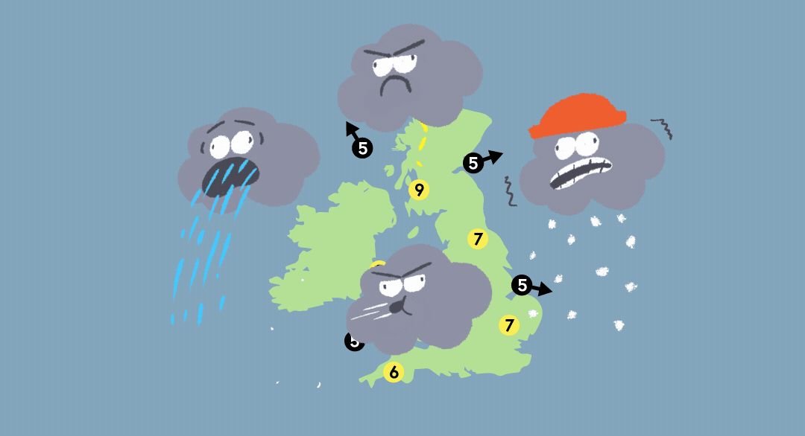

# Forecaster

## Welcome

Thank you for taking the time to review Forecaster, a weather application!

## Description

[forecaster](https://github.com/VMLujanJr/forecaster) allows you to search for a city and display the current weather in real-time.

You may also visit the [website](https://vmlujanjr.github.io/forecaster/) to try it out for yourself!

## Table of Contents

- [Forecaster](#forecaster)
  - [Welcome](#welcome)
  - [Description](#description)
  - [Table of Contents](#table-of-contents)
  - [Objectives](#objectives)
  - [Acceptance Criteria](#acceptance-criteria)
    - [**Additional Criteria**](#additional-criteria)
    - [**MOCK UP**](#mock-up)
  - [Languages](#languages)
  - [Installation](#installation)
  - [Usage](#usage)
  - [Credit](#credit)
  - [License](#license)

## Objectives
```
AS A traveler
I WANT to see the weather outlook for multiple cities
SO THAT I can plan a trip accordingly
```

## Acceptance Criteria

GIVEN a weather dashboard with form inputs
- [x] WHEN I search for a city
THEN I am presented with current and future conditions for that city and that city is added to the search history
- [x] WHEN I view current weather conditions for that city
THEN I am presented with the city name, the date, ~~an icon representation of weather conditions~~, the temperature, the humidity, the wind speed, and the UV index
- [x] WHEN I view the UV index
THEN I am presented with a color that indicates whether the conditions are favorable, moderate, or severe
- [x] WHEN I view future weather conditions for that city
THEN I am presented with a 5-day forecast that displays the date, an icon representation of weather conditions, the temperature, the wind speed, and the humidity
- [ ] WHEN I click on a city in the search history
THEN I am again presented with current and future conditions for that city

### **Additional Criteria**

**Technical Acceptance: 40%**

- [ ] Satisfies all of the above acceptance criteria
- [ ] Uses the OpenWeather API to retrieve weather data
- [ ] Uses localStorage to store persistent data

**Deployment: 32%**

- [ ] Application deployed at live URL
- [ ] Application loads with no errors
- [ ] Application GitHub URL submitted
- [ ] Portfolio at live URL submitted, featuring project

**Application Quality: 15%**

- [ ] Application user experience is intuitive and easy to navigate
- [ ] Application user interface style is clean and polished
- [ ] Application resembles mock-up functionality

**Repository Quality: 13%**

- [ ] Repository has a unique name
- [ ] Repository follows best practices for file structure and naming conventions
- [ ] Repository follows best practices for class/id naming conventions, indentation, quality comments, etc.
- [ ] Repository contains multiple descriptive commit messages
- [ ] Repository contains quality README.md with description, screenshots, link to deployed application

### **MOCK UP**


## Languages

A list of languages used for this project:

- HTML
- CSS
- JavaScript
- [Open Weather One Call API](https://openweathermap.org/api/one-call-api)

## Installation

```
(Work in progress...)
```

## Usage

```
(Work in progress...)
```

## Credit

- [VMLujanJr](https://github.com/VMLujanJr)

## License
MIT License

Copyright (c) 2022 VMLujanJr

Permission is hereby granted, free of charge, to any person obtaining a copy
of this software and associated documentation files (the "Software"), to deal
in the Software without restriction, including without limitation the rights
to use, copy, modify, merge, publish, distribute, sublicense, and/or sell
copies of the Software, and to permit persons to whom the Software is
furnished to do so, subject to the following conditions:

The above copyright notice and this permission notice shall be included in all
copies or substantial portions of the Software.

THE SOFTWARE IS PROVIDED "AS IS", WITHOUT WARRANTY OF ANY KIND, EXPRESS OR
IMPLIED, INCLUDING BUT NOT LIMITED TO THE WARRANTIES OF MERCHANTABILITY,
FITNESS FOR A PARTICULAR PURPOSE AND NONINFRINGEMENT. IN NO EVENT SHALL THE
AUTHORS OR COPYRIGHT HOLDERS BE LIABLE FOR ANY CLAIM, DAMAGES OR OTHER
LIABILITY, WHETHER IN AN ACTION OF CONTRACT, TORT OR OTHERWISE, ARISING FROM,
OUT OF OR IN CONNECTION WITH THE SOFTWARE OR THE USE OR OTHER DEALINGS IN THE
SOFTWARE.